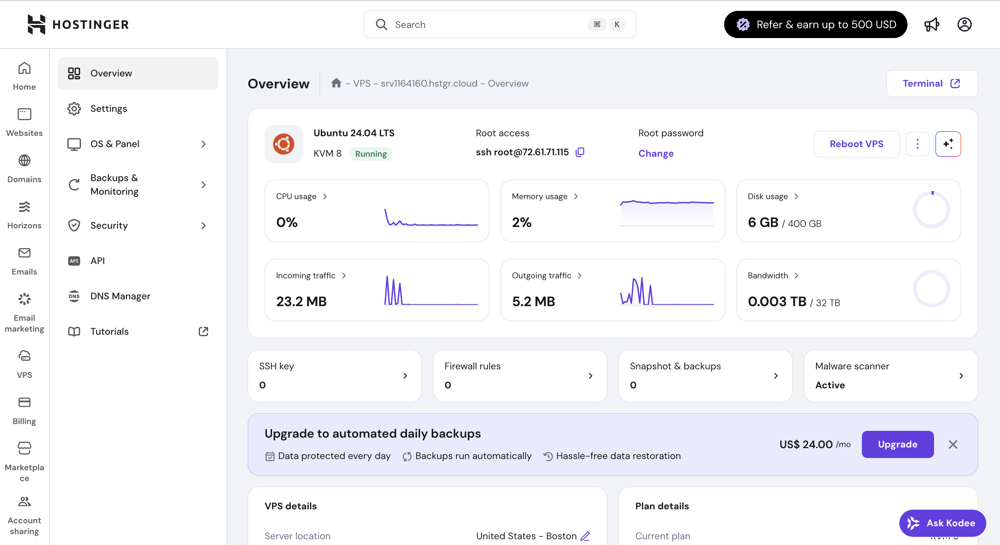

# UI migration sandbox

## Purpose
- Capture the Hostinger-inspired shell we’re trialing and why `/sandbox` exists.
- Keep the reference screenshot in-repo for offline access and future comparisons.
- Document the navigation/layout decisions before touching production surfaces.

## Reference

Source: Hostinger VPS overview (copied locally as `docs/assets/sandbox-hostinger-reference.png`).

## What `/sandbox` is for
- An isolated Next.js route to prototype the new shell without touching current navigation or flows.
- Lets us validate the two-level nav (icon rail + contextual panel), centered top search, and card-based canvas on a muted backdrop.
- Uses stubbed data only; no API wiring. Safe to iterate visually and structurally.
- Hidden from existing sidebars so we can test and iterate without user impact.

## Key layout cues we’re mirroring
- Full-width top bar: brand on the left, centered search, user on the right.
- Icon rail (Drive, Directory) with matching row cadence to the sidebar panel.
- Sidebar panel with larger list rows and per-item icons; no chevrons or descriptions.
- Content area on a light grey canvas with floating cards, clear hierarchy (title + breadcrumb), and action buttons inline.

## Migration plan (single app)
- Keep the single Next app and iterate in `/sandbox` as the UI lab.
- Extract shell primitives (top bar, icon rail, sidebar panel, card canvas, tokens) for reuse across real pages.
- Keep stubbed data aligned to production contracts/types so wiring is a swap, not a rewrite.
- Add a feature flag/param to mount the new shell around selected production pages for internal users first.
- Pilot wrapping a small set of pages (e.g., Drive list, Directory) to validate navigation and search flow.
- Iterate polish and performance; when stable, flip the flag to make the new shell default and retire the legacy nav.
